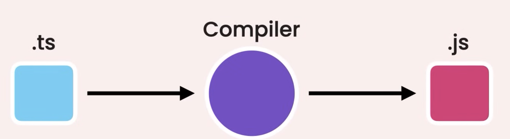
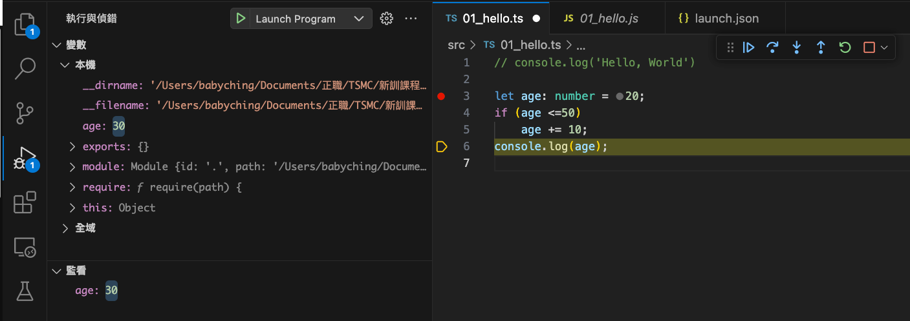

# TypeScript Introduction

這是一個紀錄TypeScript學習的文檔。
[TypeScript Document](https://www.typescriptlang.org/docs/handbook/2/everyday-types.html)

## Outline

- Introduction to TypeScript
- TypeScript Syntax
- Setting up the development environment
- Creating your first TypeScript program
- Configuring the TypeSCript Compiler
- Debugging TypeScript Applications

## Introduction to TypeScript

1. What is TypeScript?
A Programming language to address shortcomings of JavaScript.It's a development tool. Your project still runs JS.

2. TypeScript Benefits:
   - Static Typing -> Type Checking e.g. JAVA, GoLang
   - Code Completion
   - Refactoring
   - Shorthand notations -> Less code

3. TypeScript Drawbacks:
    - Additional Compilation Step 
    - Discipline in coding

## Setting up the development environment

- nodeJS
- TypeScript
`npm install -g typescript`
`tsc -v`

## TypeScript Syntax

```typescript
let variableName: type = value;
```

## Creating your first TypeScript program

Make a directory `code` and create a file `01_hello.ts` in it.

```bash
mkdir code
```

code sample:

- [hello](./code/src/01_hello.ts): A sample for hello world in TypeScript

## Configuring the TypeScript Compiler

`tsc --init` to create a `tsconfig.json` file. Some default settings should be changed:

tsconfig.json

```json
...
/* Modules */
    "module": "commonjs", /* Specify what module code is generated. */
    "rootDir": "./src",   /* Specify the root folder within your source files. */
    // "moduleResolution": "node10",
...
/* Emit */
    "outDir": "./dist", /* Specify an output folder for all emitted files. */
    "removeComments": true, /* Disable emitting comments. */
    "noEmitOnError": true, /* Disable emitting files if any type checking errors are reported. */
...
 /* Type Checking */
    "noUnusedLocals": true, /* Enable error reporting when local variables aren't read. */
    "noUnusedParameters": true, /* Raise an error when a function parameter isn't read. */
     "noImplicitReturns": true, /* Enable error reporting for codepaths that do not explicitly return in a function. */
...   
```

Execute `tsc` to compile the TypeScript files.

## Debugging TypeScript Applications

Source map are generated javascript files that map to the original TypeScript files.

Source map 是生成的 JavaScript 文件，它們映射到原始的 TypeScript 文件。"
這句話的意思是，當你使用 TypeScript寫程式碼並將其編譯成 JavaScript 時，會產生一種名為 "source map" 的特殊文件。

這個 "source map" 文件的作用是建立一個橋樑，連接你寫的原始 TypeScript 代碼和 編譯後的 JavaScript 代碼。它的存在讓你在調試編譯後的 JavaScript 代碼時，能夠清楚地知道這些代碼對應到原始 TypeScript 代碼的哪個部分。換句話說，如果你在運行網站時遇到了錯誤，而這個錯誤來自編譯後的 JavaScript 代碼，有了 source map，你就可以輕鬆找到這個錯誤在原始 TypeScript 代碼中的位置，這對於錯誤的追蹤和修復非常有幫助。

```json
...
/* Emit */
    "sourceMap": true,   /* Create source map files for emitted JavaScript files. */
...
```

In VSCode debugging create the launch configuration in `launch.json`:

```json
{
    "version": "0.2.0",
    "configurations": [
        {
            "type": "node",
            "request": "launch",
            "name": "Launch Program",
            "skipFiles": [
                "<node_internals>/**"
            ],
            "program": "${workspaceFolder}/dist/hello.js",
            "preLaunchTask": "tsc: build - tsconfig.json", /* Add this line */
            "sourceMaps": true
        }
    ]
}
```

VSCode debugging:

