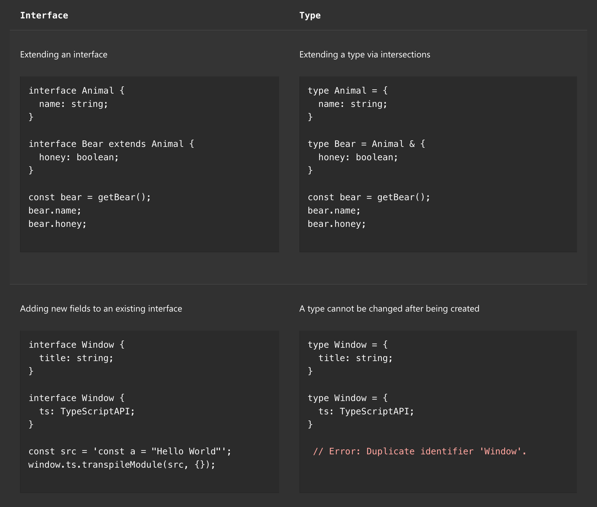

# TypeScript Fundamentals

這是一個 TypeScript 基礎的筆記，主要是一些基本的概念和語法。

## Outline

- Number, String, Boolean
- The any Type
- Functions
- Objects
- Arrays
- Tuple
- Enums
- interface

## Number, String, Boolean

[01_hello.ts](./code/src/01_hello.ts) 中的範例已經展示了這三種基本的數據類型。

## The any Type

TypeScript 擴展了 JavaScript 的基本數據類型，並引入了一些新的數據類型。
JavaScript: number, string, boolean, null, undefined, object
TypeScript: any, unknown, never, enum, tuple

TypeScript has a special type, `any`, that you can use whenever you don't want a particular value to cause type-checking errors. （不想對其進行type-checking時）

code sample:

- [Any](./code/src/02_any.ts): A sample for the `any` type in TypeScript.

## Functions

Functions 是一個執行特定任務的代碼塊。

```typescript
function calculateTax(income: number, taxYear = 2022): number {
    if (taxYear < 2022) 
        return income * 1.2;
    return income * 1.3;
}

calculateTax(10_000)
```

More code sample:

- [Functions](./code/src/02_functions.ts): A sample for the `functions` in TypeScript.

## Objects

objects 是一個包含鍵值對的數據結構。他可以包含多個屬性，每個屬性都有一個名稱和一個值。

```typescript

// readonly: 只能讀取，不能寫入
// retire 是一個方法，這個方法接受一個 Date 型別的參數，並且沒有返回值。
let employee: {
    readonly id: number;
    name: string;
    retire: (date: Date) => void 
} = { 
    id: 1, 
    name: 'Mosh',
    retire: (date: Date) => {
        console.log(date);
    }
}

```

code sample:

- [Objects](./code/src/02_objects.ts): A sample for the `objects` in TypeScript.

## readonly and optional


## Arrays

Array 的值是一個有序的集合，可以包含多個元素，每個元素的值可以被訪問和修改。

code sample:

- [Array](./code/src/02_array.ts): A sample for the `array` type in TypeScript.

## Tuple

Tuple 是一個有固定長度的數組，其中每個元素的類型都是已知的。在處理一對值時，Tuple 是一個很好的選擇。

```typescript
// 對於每個使用者會想要表示兩個值，一個是使用者的id，另一個是使用者的名字
// 1, 'Mosh'
let user: [number, string] = [1, 'Mosh']

// Video 2 
let tUser: [string, number, boolean]
tUser = ['Mosh', 1, true]

let rgb: [number, number, number] = [255, 0, 0]

type aUser = [number, string]
const newUser: aUser = [112, 'example@mail.com']

// tuple 的一些問題
newUser[1] = 'hc.com' // 改變值
newUser.push('fdf') // 可以 push 進去，但是不會報錯
```

code sample:

- [Tuple](./code/src/02_tuple.ts): A sample for the `tuple` type in TypeScript.

## Enums

Enums 是一個用於定義命名常量的集合。

```typescript
// PascalCase: 首字母大寫
const enum Size{ Small = 1, Medium, Large }
let mySize: Size = Size.Medium 
console.log(mySize)
```

code sample:

- [Enums](./code/src/02_enums.ts): A sample for the `enums` type in TypeScript.

## interface

interface 是一個用於定義對象的結構的類型。

```typescript

interface bUser {
    readonly dbId: number
    email: string
    userId: number
    googleId ?: string
    // startTrail: () => string
    startTrail(): string
    getCoupon(couponname: string, value:number): number
}

interface bUser {
    githubToken: string
}

interface TAdmin extends bUser {
    role: 'admin' | 'ta' | 'learner'
}

const duck2: TAdmin ={
    dbId: 22,
    email: 'k@k.com',
    role: 'admin',
    userId: 2211,
    startTrail: () => {
        return 'trail started'
    },
    getCoupon: (name: 'duck10', off: 10) => {
        console.log(name, off)        
        return 10
},
    githubToken: 'github'
}
```

code sample:

- [interface](./code/src/02_interface.ts): A sample for the `interface` type in TypeScript.

